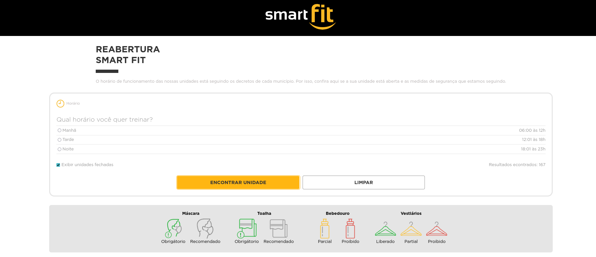
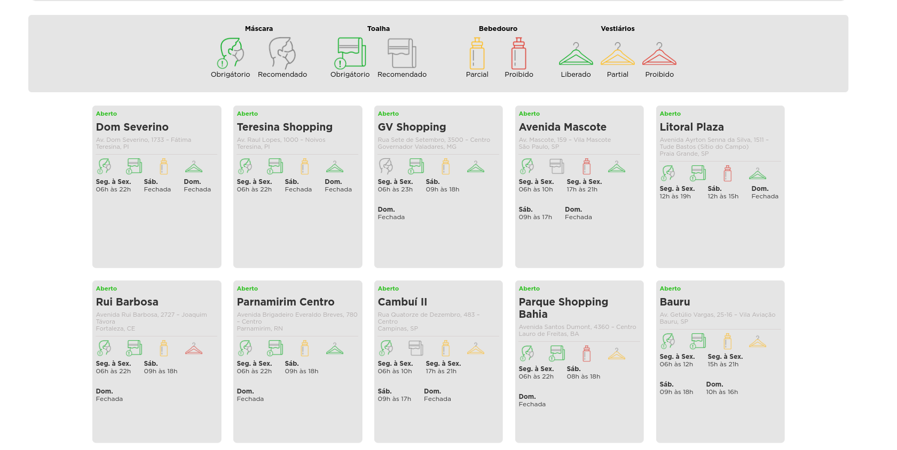

# Desafio Frontend - Smart Fit


Vídeo da solução do desafio no canal da [Fernanda Kipper | Dev](https://www.youtube.com/watch?v=ozZXMkp8MnQ).

## 📖 Sobre o desafio

A Smart Fit, atuando no segmento de fitness, passou por várias mudanças durante a pandemia. Foi necessário desenvolver uma página para buscar unidades abertas ou fechadas para consulta e reserva.

Neste desafio, foi implementado as seguintes funcionalidades de acordo com as regras de negócio definidas:

### Funcionalidades
[x] Carrega unidades através do arquivo JSON [locations.json](https://test-frontend-developer.s3.amazonaws.com/data/locations.json) utilizando o método `GET`.
[x] Busca por todas as unidades.
[x] Busca por unidades com filtros.
[x] Previsão do número de resultados encontrados.
[x] Listagem das unidades encontradas após a busca.

### Regras de negócio
- Filtra unidades abertas ou fechadas.
- Filtra unidades por período de funcionamento.
- Exibe a mensagem "Nenhuma unidade encontrada" quando não há resultados.
- Valida e exibe os ícones corretos de acordo com o status da unidade.

## 🎨 Layout

O layout da aplicação foi baseado nos materiais disponibilizados, incluindo designs para dispositivos móveis e desktop, cores, imagens e fontes. A fidelidade ao layout proposto foi mantida, e a aplicação é responsiva para dispositivos móveis, tablets e desktops.

## ⚙️ Como Executar

Para executar a aplicação localmente, siga os passos abaixo:

1. Clone este repositório:

```bash
  git clone https://github.com/marcoantn020/desafio-smartfit.git
```

2. Instale as dependências

```bash
  npm install
```

3. Inicie a aplicação

```bash
  npm start
```

4. abra um novo terminal 

```bash
  npm api
```

[url-project](http://localhost:4200)





## Licença
Este projeto está sob a licença MIT. Consulte o arquivo [LICENSE](./LICENSE) para obter mais detalhes.
